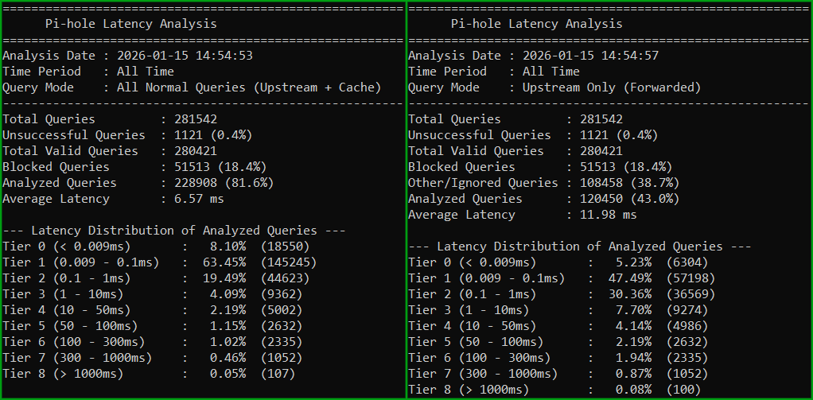

# Pi-hole Latency Stats

A lightweight Bash script to analyze your Pi-hole's DNS response times. It reads directly from the FTL database to visualize how fast your local DNS is resolving queries.

## Features

* **Dynamic Tiers:** Define your own latency buckets (e.g., <1ms, 1-10ms, >100ms).
* **Time Filtering:** Analyze the last 24h, 7d, or any custom duration.
* **Smart Metrics:** Automatically calculates **Average**, **Median**, and **95th Percentile** latency.
* **JSON Output:** Export data in raw JSON format for dashboards (Home Assistant, Node-RED, etc.).
* **Dual Output:** View human-readable text on screen even while saving raw JSON to a file.
* **Silent Mode:** Run completely silently for cron jobs or background tasks.
* **Domain Filtering:** Supports **Wildcards** (`*`, `?`) with two modes:
* **Partial Match:** Search for any domain containing a pattern.
* **Exact Match:** Analyze a specific domain pattern and its subdomains only.


* **Configuration Profiles:** Define default arguments inside the config file to create preset "Profiles" that override CLI flags.
* **Sequential Saving:** Automatically number your saved reports (e.g., `report_1.txt`) to prevent overwrites.
* **Flexible Paths:** Load configurations and save reports to **any folder** on your system.
* **Query Modes:** Isolate **Upstream** (Internet) latency from **Local** (Pi-hole Cache) latency.

<p align="center">

</p>

## Installation

**Requires sqlite3**

1. Download the script:
```bash
wget -O pihole_stats.sh https://github.com/panoc/pihole-latency-stats/releases/download/v2.2/pihole_stats.sh

```


2. Make it executable:
```bash
chmod +x pihole_stats.sh

```


3. Run it once to generate the default configuration file:
```bash
sudo ./pihole_stats.sh

```


## Usage

Run the script using `sudo` (required to read the Pi-hole database). You can mix and match arguments in any order.

> **Tip:** If your file paths contain spaces or your domain patterns contain wildcards (e.g., `*`), **always wrap them in quotes** (e.g., `-dm "*.google.com"`).

### Basic Usage

**Analyze All Time (Default)**

```bash
sudo ./pihole_stats.sh

```

**Get Help**
Run `sudo ./pihole_stats.sh --help` to see a full list of commands and examples.

### Time Filtering

**Analyze Last 24 Hours**

```bash
sudo ./pihole_stats.sh -24h

```

**Analyze Last 7 Days**

```bash
sudo ./pihole_stats.sh -7d

```

### Saving Output (Files & Logs)

You can save the output to a file using the `-f` flag. You can use absolute paths to save files to specific folders.

**Basic Save (Overwrites if exists)**

```bash
sudo ./pihole_stats.sh -24h -f report.txt

```

**Save to a specific folder (with spaces)**

```bash
sudo ./pihole_stats.sh -f "/home/pi/My Documents/dns_reports/weekly.txt"

```

**Add Timestamp (`-ts`)**
Automatically inserts the date and time (YYYY-MM-DD_HHMM) into the filename.

* Command: `sudo ./pihole_stats.sh -f report.json -ts`
* Result: `report_2026-01-16_0930.json`

**Add Sequential Numbering (`-seq`)**
Prevents overwriting by adding a number if the file already exists.

* Command: `sudo ./pihole_stats.sh -f report.json -seq`
* Result: `report_1.json` (if `report.json` exists)

**Combine Everything (Best for Cron)**
Combine both for organized, conflict-free logs.

```bash
sudo ./pihole_stats.sh -f daily_log.json -ts -seq

```

* Result: `daily_log_2026-01-16_0930_1.json`

### JSON Output (Automation)

Use the `-j` or `--json` flag to output the results in JSON format. Useful for feeding data into other tools.

**Print JSON to screen**

```bash
sudo ./pihole_stats.sh -j

```

**Save JSON to a file (and see Text summary on screen)**
This command saves the raw JSON to the file but still shows you the human-readable text report on your terminal.

```bash
sudo ./pihole_stats.sh -j -f stats.json

```

### Silent Mode

Use the `-s` or `--silent` flag to suppress all screen output. This is perfect for cron jobs or automated scripts where you only want the file saved.

```bash
# Save report silently (no text printed to terminal)
sudo ./pihole_stats.sh -f daily_report.txt -s

```

### Domain Filtering

Use these flags to analyze latency for specific websites. Both flags support **Wildcards**:

* `*` matches any number of characters.
* `?` matches exactly one character.
* **`-dm` or `--domain` (Partial Match):**
Matches any query *containing* the pattern. Useful for broad searches.
* *Example:* `-dm "goo*le"` finds `google.com`, `goooogle.gr`, `good-letters.com`.


```bash
sudo ./pihole_stats.sh -dm "google"

```


* **`-edm` or `--exact-domain` (Exact Match):**
Matches the exact domain pattern and its subdomains, but respects the structure.
* *Example:* `-edm "fr*z.com"` finds `fritz.com` and `fraz.com`.
* *Example:* `-edm "*.google.com"` finds `maps.google.com` but ignores `google.com.badsite.net`.


```bash
sudo ./pihole_stats.sh -edm "netflix.com"

```


### Configuration Profiles (Advanced)

The script uses `pihole_stats.conf` by default, but you can create and load custom configuration files.

**Create a new config file (`-mc`)**
Generates a fresh configuration file at the specified path.

```bash
# Create a config in a specific folder
sudo ./pihole_stats.sh -mc "/home/pi/configs/google_stats.conf"

```

**Load a specific config file (`-c`)**
Runs the script using the settings from your custom file.

```bash
sudo ./pihole_stats.sh -c "/home/pi/configs/google_stats.conf"

```

**Using Profiles (`CONFIG_ARGS`)**
You can turn a config file into a "Profile" by defining arguments inside the file itself.

1. Edit your custom config file (e.g., `google.conf`).
2. Add the `CONFIG_ARGS` variable:
```bash
CONFIG_ARGS="-h24 -edm google.gr -j -f google_results.json"

```


3. Run the script with just the `-c` flag. The script will automatically apply all arguments from the file, ignoring any other CLI flags.

### Advanced Filtering (Modes & Flags)

You can isolate specific types of queries to troubleshoot where latency is coming from.

* **`-up` (Upstream Only):** Analyzes only queries forwarded to your upstream DNS (e.g., Google, Cloudflare). Use this to check your internet connection speed.
* **`-pi` (Pi-hole Only):** Analyzes only queries answered by the Pi-hole Cache or Optimizers. Use this to check your Pi-hole hardware performance.
* **`-nx` (Exclude Upstream Blocks):** Excludes queries that were blocked by the upstream provider (Status 16/17, e.g., NXDOMAIN or 0.0.0.0 replies). Use this if you only want to measure latency for *successful* resolutions.
* **`-db` (Custom Database):** Specify a custom path to the FTL database. Useful for Docker containers or non-standard installs.

#### Examples

```bash
# Check upstream latency for the last hour
sudo ./pihole_stats.sh -up -1h

# Check upstream latency, ignore upstream blocks, and save to JSON
sudo ./pihole_stats.sh -up -nx -24h -j -f upstream_report.json

# Use a custom database path
sudo ./pihole_stats.sh -db /mnt/user/appdata/pihole/pihole-FTL.db

```

## Understanding the Metrics

* **Average:** The arithmetic mean. Useful, but often skewed by a few slow queries.
* **Median (P50):** The "Middle" query. Represents your typical experience. If your cache hit rate is high, this will be near 0ms.
* **95th Percentile (P95):** The "Realistic Worst Case." 95% of your queries are faster than this. This is the best metric to judge your actual internet speed, ignoring extreme outliers.

## Configuration File

On the first run, the script creates `pihole_stats.conf` in the same directory. You can edit this file to permanently set your preferences:

1. **Define Latency Tiers:** Customize your buckets (e.g., 0.1ms, 50ms, 100ms).
2. **Set Default Save Directory:** Define a specific folder (e.g., `/home/pi/logs`) where all `-f` files will be saved automatically.
3. **Set Database Path:** Permanently override the default `/etc/pihole/pihole-FTL.db` location.
4. **Set Default Arguments:** Use `CONFIG_ARGS` to define default flags that run every time.

```bash
# Example pihole_stats.conf content

# Where to save files by default
SAVE_DIR="/home/pi/pihole_reports"

# Default arguments to always run (optional)
# CONFIG_ARGS="-up -24h"

# Your custom latency buckets
L01="0.5"
L02="20"
...


